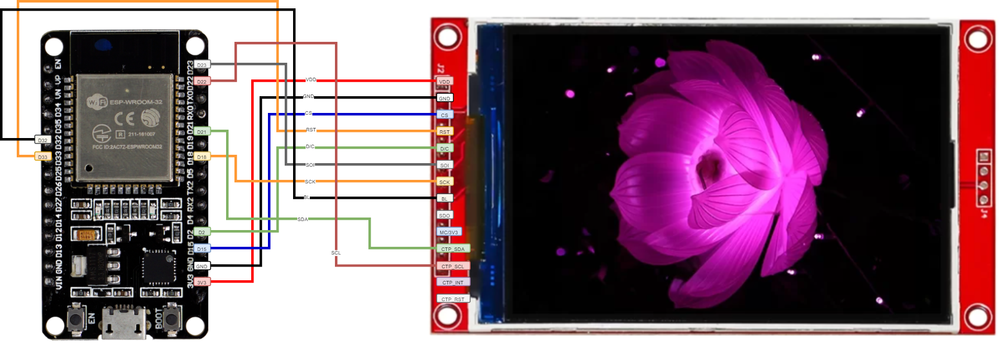
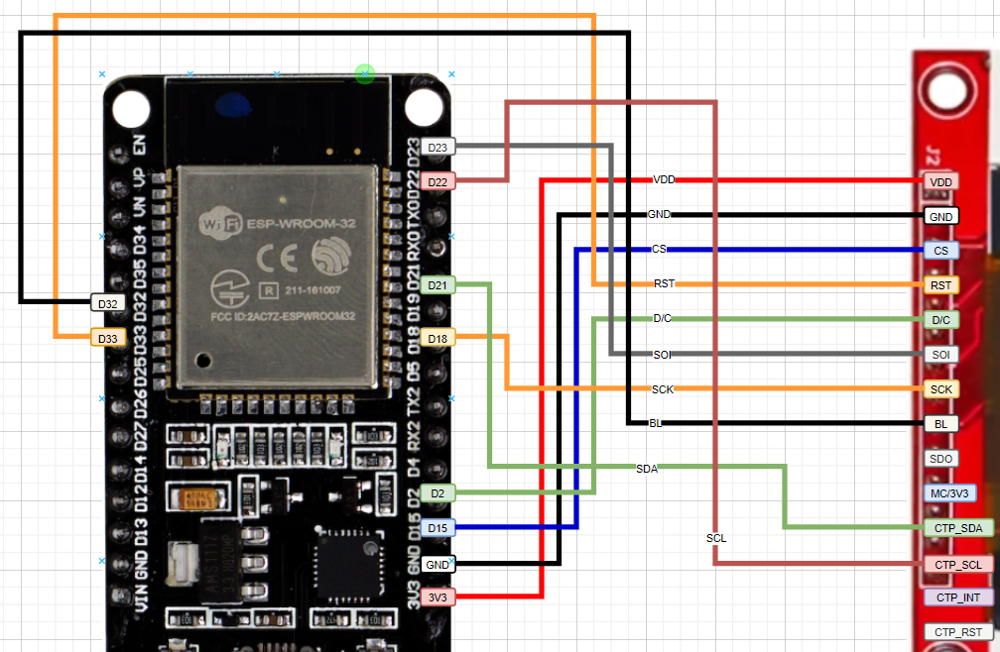

# Library_esp32_lvgl

**Schematic**
-	ESP32_3V3 --> VDD
-	ESP32_GND --> GND
-	ESP32_GPIO15 --> CS
-	ESP32_GPIO15 --> RST
-	ESP32_GPIO15 --> D/C
-	ESP32_GPIO15 --> SOI
-	ESP32_GPIO15 --> SCK
-	ESP32_GPIO15 --> BL
-	ESP32_GPIO15 --> CTP_SDA
-	ESP32_GPIO15--> CTP_SCL

